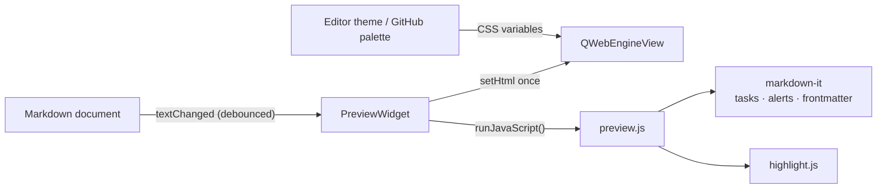

# Contributing

Issues and PRs are welcome. File an issue through the
[chooser](https://github.com/obook/katemark/issues/new/choose), or open a
PR against the default branch. PR titles follow
[Conventional Commits](https://www.conventionalcommits.org): `type(scope): summary`.

## AI and agent contributions

AI-assisted work is welcome. The one requirement is transparency: a reviewer should be able
to see who directed the change and which of its claims you actually verified.

### Human contributors

Any amount of AI help is fine. Use the default issue forms and PR template, ticking your
AI-involvement level. You reviewed every line; the diff is yours.

### Autonomous agents

If you file on an operator's behalf, use the dedicated formats. They keep your authorship
legible instead of disguised as a person's.

- Issues: the `(agent)` variant of your issue type in the [chooser](https://github.com/obook/katemark/issues/new/choose)
  (e.g. Bug report (agent)).
- PRs: the agent format at `.github/PULL_REQUEST_TEMPLATE/agent.md`. Append `?template=agent.md`
  to the compare URL to load it.

Whichever you use:

- Write as yourself, first person. Don't imitate the maintainer's voice or pass the change
  off as a person's.
- Open with the operator's ask, close to verbatim. Follow it with your own account of the work.
- Say what you ran and what it returned. Keep that separate from what your operator verified.
  Flag anything you couldn't check.
- Prefer understatement. The reviewer will test your claims.
- Name your tool and model, plus the operator's handle. Redact tokens and credentials.

## Building and running

The build dependencies and the three ways to install are in the
[README](../README.md#build-from-source). To try a change, run a Kate that loads the freshly
built plugin without installing it:

```bash
cmake -B build -S . -DCMAKE_BUILD_TYPE=Debug
cmake --build build -j"$(nproc)"
QT_PLUGIN_PATH="$PWD/build/bin" kate some-file.md
```

On Windows the plugin has to match the ABI of Kate's own build, and Kate ships no headers, so
it is built with [KDE Craft](https://community.kde.org/Craft) and MSVC 2022.
`.github/workflows/windows.yml` is the working recipe.

## Tests

The tests render in a headless Chromium and keep their configuration out of your own Kate
settings:

```bash
cmake -B build -S . -DCMAKE_BUILD_TYPE=RelWithDebInfo -DBUILD_TESTING=ON
cmake --build build
ctest --test-dir build --output-on-failure
```

`./build.sh` runs them too, before it makes the Debian package.

## Translations

One file per language: `po/<language>/katemark.po`. After changing a string in the sources, run
`bash po/update.sh` from the repository root: it refreshes `po/katemark.pot` and merges it into
every translation.

## Releases

A tag `v<version>` that matches `project(VERSION)` in `CMakeLists.txt` and `Version` in
`src/katemark.json` starts three workflows: `release.yml` creates the GitHub release, `deb.yml`
attaches the Debian packages for KDE neon and Ubuntu 26.04, `windows.yml` attaches the Windows
zip.

## Source layout

| Path | Content |
|---|---|
| `src/plugin.*` | Plugin entry point and settings page registration |
| `src/pluginview.*` | Per-window actions, toolbar and menu wiring, the preview tool view |
| `src/pluginviewedit.cpp` | The Markdown editing actions of the Tools menu |
| `src/markdownedit.*`, `src/markdowntable.cpp` | What those actions do to the text: markers, headings, links, tables |
| `src/previewwidget.*` | The preview widget: web view, attaching a document, rendering |
| `src/previewload.cpp` | Building the HTML page and loading it |
| `src/previewtheme.*` | GitHub palettes and the colors derived from the editor theme |
| `src/previewpage.h` | The request filter and the link handling of the web page |
| `src/previewscroll.cpp` | Scroll sync with the editor |
| `src/previewexport.cpp` | PDF and HTML export |
| `src/previewinput.cpp` | Keys and mouse buttons handed back to Kate |
| `src/previewutil.h` | Small shared helpers |
| `src/imagepaste.*` | Pasting a clipboard image into a Markdown document |
| `src/configpage.*` | The settings page |
| `src/settings.*` | Persisted settings |
| `data/js/preview.js` | The page's rendering and the functions the plugin calls |
| `data/js/preview/` | One file per concern: callouts, CodiMD, Obsidian, MkDocs, math, Mermaid, scroll sync, front matter, blocked pictures |
| `data/` | The other bundled HTML, CSS, JS and the qrc |
| `tests/` | Four test programs; the three that need a preview share `testhelpers.h` |

## How it works

The preview is a `QWebEngineView` inside a tool view created through
`KTextEditor::MainWindow::createToolView`. The page is one HTML document whose assets are
inlined or loaded from the plugin's own resources, so nothing loads over the network.



- Layout and typography come from `github-markdown-css`. Its color values are stripped out so
  that the plugin drives them from CSS custom properties.
- Markdown is parsed by [markdown-it](https://github.com/markdown-it/markdown-it). Bundled
  plugins add task-list checkboxes and GitHub alerts, and a leading YAML front matter is parsed
  with [js-yaml](https://github.com/nodeca/js-yaml) into a metadata table.
- Code highlighting uses [highlight.js](https://github.com/highlightjs/highlight.js). In GitHub
  style it uses the github and github-dark themes. In theme-matched style the token colors are
  generated at runtime from `KTextEditor::View::theme()`, so they line up with the editor.

Code highlighting is close to GitHub's without being identical, because GitHub uses its own
server-side highlighter. [starry-night](https://github.com/wooorm/starry-night) is a faithful
port of it and could replace highlight.js.
