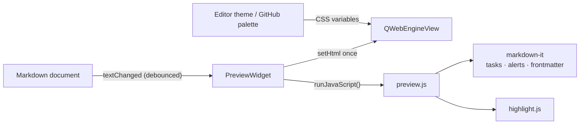

<div align="center">

# Katdown

**KDE Kate Markdown preview plugin: GitHub theme with native and system color support.**

[](LICENSE)
&nbsp;[](https://github.com/uwuclxdy/katdown/actions/workflows/ci.yml)
&nbsp;
&nbsp;

</div>

Kate's built-in preview uses a plain Qt renderer that looks nothing like GitHub. The other option, `kmarkdownwebview`, was abandoned in 2020 and never ported to KF6. This plugin fills that gap: it renders with the actual [github-markdown-css](https://github.com/sindresorhus/github-markdown-css), so headings, tables, blockquotes, task lists and alerts match what you would see on github.com. Fully offline.

This fork puts the preview beside the editor and scrolls the two together. It also reads CodiMD and Obsidian syntax, math and Mermaid diagrams, exports to PDF and HTML, and comes in 44 languages.

## Screenshots

| GitHub style | Theme-matched style |
| :----------: | :-----------------: |
|  |  |

## Installation

The AUR package and the Windows zip below are builds of the original Katdown: they do not have this fork's additions. To get those, build from source or make the Debian package.

### Arch Linux (recommended)

Install [`katdown-git`](https://aur.archlinux.org/packages/katdown-git) from the AUR with any helper:

```bash
yay -S katdown-git   # or: paru -S katdown-git
```

The package builds from the latest commit and pulls in every dependency. Then enable it: Settings, then Configure Kate, then Plugins, then check Katdown.

### Windows

Download `katdown-<version>-windows-x86_64.zip` from the [latest release](https://github.com/uwuclxdy/katdown/releases/latest), unzip it, close Kate and run this in an **elevated** PowerShell:

```powershell
powershell -ExecutionPolicy Bypass -File install.ps1
```

It finds Kate on its own, or takes `-KateDir "D:\Kate"`. `-WhatIf` shows what it would do, `-Uninstall` removes exactly what it installed. 
Then enable it: Settings -> Configure Kate -> Plugins -> check Katdown.

The zip is about 90 MB and unpacks to roughly 220 MB, because Kate for Windows ships no Qt WebEngine, and the preview is a web view, so the runtime comes along with the plugin. Windows resolves a plugin's dependencies from the folder holding `kate.exe`, which is why those files install next to Kate rather than beside the plugin.

Two limits worth knowing before you download it:

- Kate has to come from the [installer](https://kate-editor.org/get-it/), **Microsoft Store version is not supported**.
- The build targets Kate's Qt 6.11.x. `install.ps1` checks and refuses on a mismatch, because installing anyway produces a plugin that never loads and never says why.

### Build from source

```bash
git clone -b codimd https://github.com/obook/katdown.git
cd katdown
cmake -B build -S . -DCMAKE_BUILD_TYPE=RelWithDebInfo -DCMAKE_INSTALL_PREFIX=/usr
cmake --build build
```

**System-wide** install (loads in every Kate launch):

```bash
sudo cmake --install build
```

**User-local** install (no root, but needs a re-login to take effect):

```bash
cmake --install build --prefix ~/.local
mkdir -p ~/.config/environment.d
printf 'QT_PLUGIN_PATH=%s/.local/lib/qt6/plugins\n' "$HOME" \
    > ~/.config/environment.d/katdown.conf
```

**Debian package** (Debian, Ubuntu, KDE neon): `build.sh` configures, compiles, runs the tests and makes the package in one go.

```bash
./build.sh
sudo apt install ./build/katdown_*.deb
```

The package installs only on a system with the Qt and KDE Frameworks versions it was built against.

Enable the plugin after installing: Settings -> Configure Kate -> Plugins -> check Katdown.

> [!NOTE]
> Qt WebEngine is initialized from inside Kate. On some setups you may see a console warning about `Qt::AA_ShareOpenGLContexts`. It is harmless in practice.

## Requirements

The AUR package resolves these for you. You only need them to build from source.

- Kate / KTextEditor 6 (KF6)
- Qt 6 with WebEngine

On Arch:

```bash
sudo pacman -S --needed base-devel cmake extra-cmake-modules \
    ktexteditor qt6-webengine kcoreaddons ki18n kconfig kxmlgui ksyntaxhighlighting
```

On KDE neon:

```bash
sudo apt install g++ cmake extra-cmake-modules gettext qt6-webengine-dev \
    kf6-ktexteditor-dev kf6-kcoreaddons-dev kf6-ki18n-dev kf6-kconfig-dev \
    kf6-kxmlgui-dev kf6-syntax-highlighting-dev
```

Building it yourself on Windows means [KDE Craft](https://community.kde.org/Craft) with MSVC 2022, since the plugin has to match the ABI of Kate's own build and Kate ships no headers. `.github/workflows/windows.yml` is the working recipe.

## Usage

Open any Markdown file in Kate:

```bash
kate path/to/notes.md
```

Then trigger the preview in one of three ways:

- press <kbd>Ctrl</kbd>+<kbd>Shift</kbd>+<kbd>M</kbd>, or
- click the Katdown button in the main toolbar (Settings, then Toolbars Shown, then Main Toolbar if it is hidden), or
- use Tools, then Katdown.

The preview opens in a tool view docked on the right of the editor, like Kate's own document preview, so the source stays visible on the left. It follows the active Markdown document and re-renders as you edit. Triggering it again hides it.

The editor and the preview scroll together: scrolling either side brings the other to the same place in the document.

Tools also has **Export Preview as PDF** and **Export Preview as HTML**. Both use GitHub's light look whatever the preview shows. The HTML file stands on its own: the pictures stored on your computer are embedded in it and it holds no script.

Pasting while the clipboard holds only an image saves it as a PNG beside the document and inserts the link.

Besides GitHub's own syntax, the preview renders:

- CodiMD: `:::success`, `:::info`, `:::warning` and `:::danger` alert areas (also under the Docusaurus names `note`, `tip`, `caution`), `:::spoiler`, `==mark==`, `++ins++`, `H~2~O`, `19^th^`, footnotes, `[TOC]` and emoji by name (`:warning:`).
- Obsidian: callouts (`> [!faq]- Title`, with every type and alias, custom titles and folding), wiki links (`[[Note]]`, `[[Note|label]]`, `[[Note#Heading]]`), image embeds with a size (`![[image.png|300]]`) and `%%comments%%`. Links resolve against the document's folder, not across a vault.
- MkDocs: `!!! note "Title"` admonitions with an indented body, `??? note` for a folded one, `???+ note` for one that starts open.
- Math in `$...$`, `$$...$$`, `\(...\)` and `\[...\]`, rendered by KaTeX and tolerant of what MathJax accepts (`\require{...}`, inline math over several lines, `\newcommand` on a command that exists). A macro defined in a formula serves the formulas after it, and `$$...$$ (1)` numbers an equation.
- Mermaid diagrams in ` ```mermaid ` blocks. <kbd>Ctrl</kbd> + wheel zooms a diagram, a double click puts it back.

`examples/` has one demonstration document each for GitHub, CodiMD, Obsidian and MkDocs.

Tools, then Markdown, has editing helpers for the document itself:

| Action | Shortcut |
|---|---|
| Bold | <kbd>Ctrl</kbd>+<kbd>Alt</kbd>+<kbd>B</kbd> |
| Italic | <kbd>Ctrl</kbd>+<kbd>Alt</kbd>+<kbd>E</kbd> |
| Strikethrough | <kbd>Ctrl</kbd>+<kbd>Alt</kbd>+<kbd>S</kbd> |
| Increase or decrease the heading level | <kbd>Ctrl</kbd>+<kbd>Alt</kbd>+<kbd>=</kbd> and <kbd>Ctrl</kbd>+<kbd>Alt</kbd>+<kbd>-</kbd> |
| Paste as link: the selection becomes a link to the address in the clipboard | <kbd>Ctrl</kbd>+<kbd>Shift</kbd>+<kbd>V</kbd> |
| Format table: align the columns of the table under the cursor | <kbd>Ctrl</kbd>+<kbd>Alt</kbd>+<kbd>F</kbd> |

<kbd>Ctrl</kbd>+<kbd>B</kbd> and <kbd>Ctrl</kbd>+<kbd>I</kbd>, usual in other Markdown editors, are Kate's bookmark and indentation shortcuts; change any of these under Settings, then Configure Keyboard Shortcuts.

Switching to a document that is not Markdown, or closing the previewed one, leaves the preview on its last content until another Markdown document becomes active.

## Configuration

Settings -> Configure Kate -> (Plugins -> enable `Katdown`) -> Katdown.


| Setting | Options | What it does |
|---------|---------|--------------|
| Style | GitHub / Match editor or system theme | GitHub uses GitHub's palette. Match recolors the same layout from your active editor theme. |
| GitHub variant | Auto / Light / Dark | Which GitHub palette to use. Auto follows whether your system is light or dark. Only applies in GitHub style. |
| Math macros | `\newcommand` lines | Macros defined before every document, so that all your formulas can use them. |
| Load media previews from remote URLs | On / Off (default) | When on, images referencing `http(s)` URLs are fetched and rendered. When off (the default), the preview loads no remote resources and works fully offline. Images with paths relative to the document always load regardless of this setting. |

Change the shortcut under Settings, then Configure Keyboard Shortcuts, search for Katdown.

<details>
    <summary><h2>How it works</h2></summary>

The preview is a `QWebEngineView` inside a tool view created through `KTextEditor::MainWindow::createToolView`. The page is one HTML document whose assets are inlined or loaded from the plugin's own resources, so nothing loads over the network.



- Layout and typography come from `github-markdown-css`. The built-in color values are stripped out so the plugin can drive them from CSS custom properties.
- Markdown is parsed by [markdown-it](https://github.com/markdown-it/markdown-it). Small bundled plugins add task-list checkboxes and GitHub alerts, and leading YAML frontmatter is parsed with [js-yaml](https://github.com/nodeca/js-yaml) into a metadata table.
- Code highlighting uses [highlight.js](https://github.com/highlightjs/highlight.js). In GitHub style it uses the github/github-dark themes. In theme-matched style the token colors are generated at runtime from `KTextEditor::View::theme()`, so they line up with the editor.

Code highlighting is close to GitHub but not byte-identical, because GitHub uses its own server-side highlighter rather than highlight.js. If needed, [starry-night](https://github.com/wooorm/starry-night) is a faithful port of GitHub's highlighter and could replace highlight.js.

</details> 

## Development

Build, then run Kate that loads the freshly built plugin without installing it:

```bash
cmake -B build -S . -DCMAKE_BUILD_TYPE=Debug
cmake --build build -j"$(nproc)"
QT_PLUGIN_PATH="$PWD/build/bin" kate some-file.md
```

Tests render in a headless Chromium and keep their config out of your own Kate settings:

```bash
cmake -B build -S . -DCMAKE_BUILD_TYPE=RelWithDebInfo -DBUILD_TESTING=ON
cmake --build build
ctest --test-dir build --output-on-failure
```

## Translations

The interface comes in 44 languages, one file each: `po/<language>/katdown.po`. No native speaker has reviewed them, French apart, so corrections are welcome. After changing a string in the sources, run `bash po/update.sh` from the repository root: it refreshes `po/katdown.pot` and merges it into every translation.

Source layout:

- `src/plugin.*` plugin entry point and config page registration
- `src/pluginview.*` per-window actions, toolbar/menu wiring, the preview tool view
- `src/pluginviewedit.cpp` the Markdown editing actions of the Tools menu
- `src/markdownedit.*` and `src/markdowntable.cpp` what those actions do to the text: markers, headings, links, tables
- `src/previewwidget.*` the preview widget: web view, attaching a document, rendering
- `src/previewload.cpp` building the HTML page and loading it
- `src/previewtheme.*` GitHub palettes and the colors derived from the editor theme
- `src/previewpage.h` the request filter and the link handling of the web page
- `src/previewscroll.cpp` scroll sync with the editor
- `src/previewexport.cpp` PDF and HTML export
- `src/previewinput.cpp` keys and mouse buttons handed back to Kate
- `src/previewutil.h` small shared helpers
- `src/imagepaste.*` pasting a clipboard image into a Markdown document
- `src/configpage.*` the settings page
- `src/settings.*` persisted settings
- `data/js/preview.js` the page's rendering and the functions the plugin calls
- `data/js/preview/` one file per concern: callouts, CodiMD, Obsidian, MkDocs, math, Mermaid, scroll sync, front matter, blocked pictures
- `data/` the other bundled HTML, CSS, JS and the qrc
- `tests/` four test programs; the three that need a preview share `testhelpers.h`

## Credits

Author of this fork: Olivier Booklage (<olivier.booklage@ac-bordeaux.fr>).

It is a fork of [Katdown](https://github.com/uwuclxdy/katdown) by uwuclxdy (GPL-3.0-or-later).

Bundled libraries:

| Library | Version | License | URL |
|---|---|---|---|
| markdown-it | 14.1.0 | MIT | https://github.com/markdown-it/markdown-it |
| markdown-it-container | 4.0.0 | MIT | https://github.com/markdown-it/markdown-it-container |
| markdown-it-mark | 4.0.0 | MIT | https://github.com/markdown-it/markdown-it-mark |
| markdown-it-ins | 4.0.0 | MIT | https://github.com/markdown-it/markdown-it-ins |
| markdown-it-sub | 2.0.0 | MIT | https://github.com/markdown-it/markdown-it-sub |
| markdown-it-sup | 2.0.0 | MIT | https://github.com/markdown-it/markdown-it-sup |
| markdown-it-footnote | 4.0.0 | MIT | https://github.com/markdown-it/markdown-it-footnote |
| markdown-it-emoji | 3.1.0 | MIT | https://github.com/markdown-it/markdown-it-emoji |
| markdown-it-texmath | 1.0.0 | MIT | https://github.com/goessner/markdown-it-texmath |
| KaTeX | 0.19.0 | MIT (fonts: SIL OFL 1.1) | https://github.com/KaTeX/KaTeX |
| Mermaid | 12.1.0 | MIT | https://github.com/mermaid-js/mermaid |
| highlight.js | 11.10.0 | BSD-3-Clause | https://github.com/highlightjs/highlight.js |
| js-yaml | 4.1.0 | MIT | https://github.com/nodeca/js-yaml |
| github-markdown-css, by Sindre Sorhus | | MIT | https://github.com/sindresorhus/github-markdown-css |

The license texts are in [THIRD-PARTY-NOTICES.md](THIRD-PARTY-NOTICES.md).

This fork reimplements the CodiMD and Obsidian syntaxes; no code comes from either project. The colors of the CodiMD alert areas are those of [Bootstrap 3](https://github.com/twbs/bootstrap) alerts (MIT).

## License

GPL-3.0-or-later. See [LICENSE](LICENSE).
