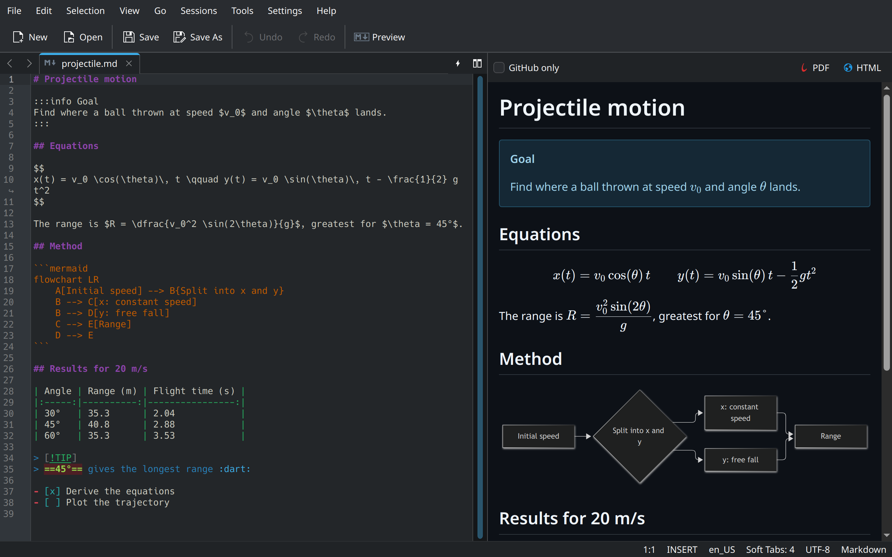
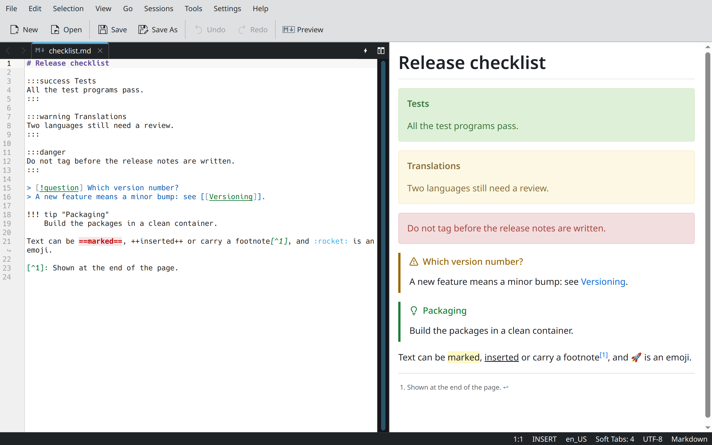
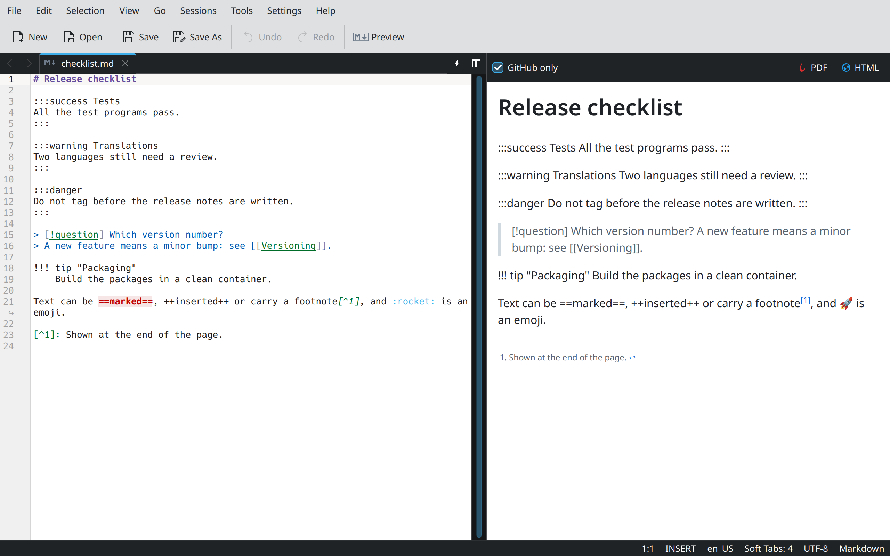
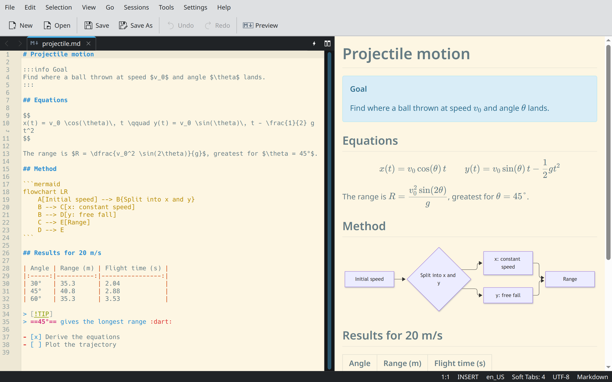

<div align="center">

# Katemark

**A Markdown preview for Kate that sits beside your text and looks like GitHub, offline.**

[](LICENSE)
&nbsp;
&nbsp;

</div>

Katemark is a plugin for [Kate](https://kate-editor.org), the KDE text
editor. It shows the Markdown document you are editing as GitHub would, in a
panel beside the editor that follows what you type and scrolls with it. The
renderer, the styles and the fonts ship with the plugin, so it works
offline.

This is a fork of [Katdown by
uwuclxdy](https://github.com/uwuclxdy/katdown), which shows the preview in a
tab of its own.

## Screenshots



| CodiMD, Obsidian and MkDocs blocks | The same document with "GitHub only" | The colors of the editor theme |
| :----------: | :----------: | :-----------------: |
|  |  |  |

## Features

| Feature | What it does | From |
|---|---|---|
| GitHub rendering | Headings, tables, task lists, alerts and highlighted code look as they do on github.com | original |
| Two styles | GitHub's colors (light or dark) or the colors of your Kate theme | original |
| Front matter | Shows a YAML header as a table | original |
| Offline | No network request, unless you allow pictures from the web | original |
| Side panel | Docks the preview beside the editor and re-renders it as you type | fork |
| Scroll sync | Scrolling the editor or the preview brings the other to the same place | fork |
| More syntax | markdown-it extensions, CodiMD, Obsidian and MkDocs | fork |
| GitHub only | A check box above the preview leaves out what GitHub would not render | fork |
| Math | LaTeX formulas, rendered by KaTeX | fork |
| Diagrams | Mermaid | fork |
| Export | A PDF or a single self-contained HTML file | fork |
| Editing actions | Bold, italic, strikethrough, heading level, paste as link, table formatting | fork |
| Image paste | Saves a picture from the clipboard beside the document and links it | fork |
| Languages | 44 interface languages | fork |

## Install

| Your system | What to do |
|---|---|
| KDE neon | [Install the package](#debian-package) `katemark_<version>_neon_amd64.deb` |
| Kubuntu 26.04 | [Install the package](#debian-package) `katemark_<version>_ubuntu26.04_amd64.deb` |
| Windows | [Install the zip](#windows) `katemark-<version>-windows-x86_64.zip` |
| Arch Linux | [Install from the AUR](#arch-linux) `katemark-git` |
| Another Debian or Ubuntu release | [Build the package](#build-from-source) with `build.sh` |
| Any other Linux | [Build from source](#build-from-source) |
| Kubuntu 24.04 | Not possible: its Kate still uses KDE Frameworks 5 |

Kate has to be a KDE Frameworks 6 build, with Qt 6.5 or later.

### Debian package

Download the file for your system from the [latest
release](https://github.com/obook/katemark/releases/latest), then:

```bash
sudo apt install ./katemark_*_amd64.deb
```

`sudo apt remove katemark` uninstalls it. Each package installs only on the
system named in its file, because KDE neon and Ubuntu name their Qt and KDE
Frameworks packages differently.

### Windows

Download `katemark-<version>-windows-x86_64.zip` from the [latest
release](https://github.com/obook/katemark/releases/latest), unzip it, close
Kate and run this in an **elevated** PowerShell:

```powershell
powershell -ExecutionPolicy Bypass -File install.ps1
```

It finds Kate on its own, or takes `-KateDir "D:\Kate"`. `-WhatIf` shows
what it would do, `-Uninstall` removes exactly what it installed.

The zip is about 90 MB and unpacks to 220 MB: Kate for Windows ships no Qt
WebEngine, so the runtime comes with the plugin. It installs next to
`kate.exe`, where Windows looks for the libraries a plugin needs.

- Kate has to come from the [installer](https://kate-editor.org/get-it/).
  The Microsoft Store version is not supported.
- The build targets the Qt 6.11 of Kate's own Windows build. `install.ps1`
  refuses to install on another version.
- The zip is built by a workflow and nobody has tried it on Windows since
  the fork: please report what you see.

### Arch Linux

Install [`katemark-git`](https://aur.archlinux.org/packages/katemark-git)
from the AUR:

```bash
git clone https://aur.archlinux.org/katemark-git.git
cd katemark-git
makepkg -si
```

`sudo pacman -R katemark-git` uninstalls it. If you installed Katemark from
source before, [uninstall](#uninstall) it first.

## First steps

1. Enable the plugin: Settings > Configure Kate > Plugins, check
   **Katemark**, click OK.
2. Open a Markdown document: a file ending in `.md`, `.markdown` or `.mkd`.
   A document whose highlighting mode is Markdown counts too.
3. Press <kbd>Ctrl</kbd>+<kbd>Shift</kbd>+<kbd>M</kbd>. The preview opens on
   the right of the editor.

The documents in [`examples/`](examples) show what the preview renders:
`github.md`, `codimd.md`, `obsidian.md` and `mkdocs.md`.

## Using the preview

| To | Do this |
|---|---|
| Show or hide the preview | <kbd>Ctrl</kbd>+<kbd>Shift</kbd>+<kbd>M</kbd>, the **Preview** button of the main toolbar or Tools > Preview |
| See the document as GitHub will show it | Check **GitHub only** above the preview |
| Export what the preview shows | The **PDF** and **HTML** buttons above the preview, or Tools > Export Preview as PDF and Tools > Export Preview as HTML |
| Follow a link | Click it: a local file opens in Kate, a web address in your browser, a link to a heading scrolls the preview |
| Zoom a Mermaid diagram | <kbd>Ctrl</kbd> + mouse wheel over it; a double click puts it back |
| Paste a picture | Copy an image, then paste in the editor |

- The preview follows the active Markdown document. When the active document
  is not Markdown, it keeps its last content.
- Both exports use GitHub's light colors, whatever the preview shows. The
  HTML file embeds the pictures stored on your computer and holds no script.
- Katemark saves a pasted picture as `image-<date>-<time>.png` in the folder
  of the document, so save the document first. It inserts the link
  `` and leaves the cursor between the brackets.
  It does so when the clipboard holds an image and no text.
- If the toolbar button is missing, show the toolbar: Settings > Toolbars
  Shown > Main Toolbar.

## Supported syntax

| Family | Syntax |
|---|---|
| GitHub | Tables, task lists (`- [ ]`), alerts (`> [!NOTE]`), `~~strikethrough~~`, bare links, highlighted code blocks, YAML front matter |
| [markdown-it](https://github.com/markdown-it/markdown-it) plugins | `==mark==` ([mark](https://github.com/markdown-it/markdown-it-mark)), `++ins++` ([ins](https://github.com/markdown-it/markdown-it-ins)), `H~2~O` ([sub](https://github.com/markdown-it/markdown-it-sub)), `19^th^` ([sup](https://github.com/markdown-it/markdown-it-sup)), footnotes ([footnote](https://github.com/markdown-it/markdown-it-footnote)), emoji by name such as `:warning:` ([emoji](https://github.com/markdown-it/markdown-it-emoji)) |
| [CodiMD](https://github.com/hackmdio/codimd) | `:::success`, `:::info`, `:::warning` and `:::danger` alert areas, also under the Docusaurus names `note`, `tip` and `caution`; `:::spoiler`; `[TOC]` |
| Obsidian | Callouts (`> [!faq]- Title`) with every type and alias, custom titles and folding; wiki links (`[[Note]]`, `[[Note\|label]]`, `[[Note#Heading]]`); image embeds with a size (`![[image.png\|300]]`); `%%comments%%` |
| MkDocs | `!!! note "Title"` admonitions with an indented body, `??? note` for a folded one, `???+ note` for one that starts open |
| Math | `$...$`, `$$...$$`, `\(...\)` and `\[...\]`, rendered by [KaTeX](https://github.com/KaTeX/KaTeX) |
| Diagrams | [Mermaid](https://github.com/mermaid-js/mermaid) in ` ```mermaid ` blocks |

- Obsidian links resolve against the folder of the document, not across a
  vault.
- With **GitHub only** checked, the preview reads the GitHub row alone, plus
  what GitHub renders too: footnotes, emoji, math and Mermaid. It also
  strikes `~text~` between single tildes, as GitHub does. The result is
  close to GitHub's without being identical: the code highlighter and the
  math engine differ.
- [markdown-it-container](https://github.com/markdown-it/markdown-it-container)
  parses the `:::` blocks.
- Math accepts what MathJax does where KaTeX is stricter: `\require{...}`,
  inline math over several lines, `\newcommand` on a command that exists.
- A macro defined in a formula serves the formulas after it, and `$$...$$
  (1)` numbers an equation.

## Editing shortcuts

Tools > Markdown holds these actions. They work in Markdown documents only.

| Action | Shortcut | What it does |
|---|---|---|
| Bold | <kbd>Ctrl</kbd>+<kbd>Alt</kbd>+<kbd>B</kbd> | Wraps the selection or the word under the cursor in `**`, and takes the marker off when it is already there |
| Italic | <kbd>Ctrl</kbd>+<kbd>Alt</kbd>+<kbd>E</kbd> | The same with `*` |
| Strikethrough | <kbd>Ctrl</kbd>+<kbd>Alt</kbd>+<kbd>S</kbd> | The same with `~~` |
| Increase Heading Level | <kbd>Ctrl</kbd>+<kbd>Alt</kbd>+<kbd>=</kbd> | Adds one heading level to the selected lines or to the line of the cursor |
| Decrease Heading Level | <kbd>Ctrl</kbd>+<kbd>Alt</kbd>+<kbd>-</kbd> | Removes one |
| Paste as Link | <kbd>Ctrl</kbd>+<kbd>Shift</kbd>+<kbd>V</kbd> | Turns the selection into a link to the address in the clipboard |
| Format Table | <kbd>Ctrl</kbd>+<kbd>Alt</kbd>+<kbd>F</kbd> | Aligns the columns of the table under the cursor |

<kbd>Ctrl</kbd>+<kbd>B</kbd> and <kbd>Ctrl</kbd>+<kbd>I</kbd> are Kate's
bookmark and indentation shortcuts. To change any shortcut: Settings >
Configure Keyboard Shortcuts, search for Katemark.

## Settings

Settings > Configure Kate, then the **Katemark** page. It appears once you
enable the plugin.

| Setting | Values | What it does |
|---|---|---|
| Style | GitHub, Match editor / system theme | Match recolors the GitHub layout from your Kate theme |
| GitHub variant | Follow system (auto), Light, Dark | Applies in GitHub style only |
| Load media previews from remote URLs | Off (default), On | When off, the preview fetches nothing and says where a picture from the web was left out. Pictures stored beside the document load in both cases |
| Math macros | `\newcommand` lines | Macros available in the formulas of every document |
| Check for updates | Button | Compares the installed version with the latest release of this repository. Katemark contacts GitHub only when you click |

## Troubleshooting

| Problem | Cause and remedy |
|---|---|
| Katemark is not in the list of plugins | Check in Help > About Kate that Kate uses KDE Frameworks 6. After a user-local install, log out and back in |
| The preview stays empty or shows another document | The active document is not Markdown: see [First steps](#first-steps) |
| `apt` reports unmet dependencies | The package is for another system: see [Install](#install) |
| A picture from the web is missing | Enable "Load media previews from remote URLs" in the [settings](#settings) |
| <kbd>Ctrl</kbd>+<kbd>B</kbd> does not make bold | See [Editing shortcuts](#editing-shortcuts) |
| The console warns about `Qt::AA_ShareOpenGLContexts` | Harmless: the plugin starts Qt WebEngine once Kate is running |

## Build from source

Install the build dependencies:

```bash
# KDE neon
sudo apt install g++ cmake extra-cmake-modules gettext dpkg-dev qt6-webengine-dev \
    kf6-ktexteditor-dev kf6-kcoreaddons-dev kf6-ki18n-dev kf6-kconfig-dev \
    kf6-kxmlgui-dev kf6-syntax-highlighting-dev

# Ubuntu 26.04
sudo apt install g++ cmake extra-cmake-modules gettext dpkg-dev qt6-webengine-dev \
    libkf6texteditor-dev libkf6coreaddons-dev libkf6i18n-dev libkf6config-dev \
    libkf6xmlgui-dev libkf6syntaxhighlighting-dev

# Arch Linux
sudo pacman -S --needed base-devel cmake extra-cmake-modules \
    ktexteditor qt6-webengine kcoreaddons ki18n kconfig kxmlgui syntax-highlighting
```

Get the sources:

```bash
git clone https://github.com/obook/katemark.git
cd katemark
```

Then choose one of three ways to install.

### As a Debian package

On Debian, Ubuntu and KDE neon. `build.sh` configures, compiles, runs the
tests and makes the package:

```bash
./build.sh
sudo apt install ./build/katemark_*.deb
```

### System-wide install

On any distribution:

```bash
cmake -B build -S . -DCMAKE_BUILD_TYPE=RelWithDebInfo -DCMAKE_INSTALL_PREFIX=/usr
cmake --build build
sudo cmake --install build
```

### User-local install

Without root. Configure and build as above, then:

```bash
cmake --install build --prefix ~/.local
mkdir -p ~/.config/environment.d
plugins=$(grep -om1 '.*/plugins' build/install_manifest.txt)
printf 'QT_PLUGIN_PATH=%s\n' "$plugins" > ~/.config/environment.d/katemark.conf
```

Log out and back in for Kate to find the plugin.

### Uninstall

From the source folder, with its `build` folder still there:

```bash
sudo cmake --build build --target uninstall   # system-wide install
cmake --build build --target uninstall        # user-local install
```

After a user-local install, also delete
`~/.config/environment.d/katemark.conf`.

## Contributing

[`.github/CONTRIBUTING.md`](.github/CONTRIBUTING.md) covers running the
plugin without installing it, the tests, the translations, the layout of the
sources and how the preview works.

No native speaker has reviewed the translations, French apart: corrections
are welcome.

## Credits

Author of this fork: Olivier Booklage (<olivier.booklage@ac-bordeaux.fr>).

It is a fork of [Katdown](https://github.com/uwuclxdy/katdown) by uwuclxdy
(GPL-3.0-or-later).

Bundled libraries:

| Library | Version | License | URL |
|---|---|---|---|
| markdown-it | 14.1.0 | MIT | https://github.com/markdown-it/markdown-it |
| markdown-it-container | 4.0.0 | MIT | https://github.com/markdown-it/markdown-it-container |
| markdown-it-mark | 4.0.0 | MIT | https://github.com/markdown-it/markdown-it-mark |
| markdown-it-ins | 4.0.0 | MIT | https://github.com/markdown-it/markdown-it-ins |
| markdown-it-sub | 2.0.0 | MIT | https://github.com/markdown-it/markdown-it-sub |
| markdown-it-sup | 2.0.0 | MIT | https://github.com/markdown-it/markdown-it-sup |
| markdown-it-footnote | 4.0.0 | MIT | https://github.com/markdown-it/markdown-it-footnote |
| markdown-it-emoji | 3.1.0 | MIT | https://github.com/markdown-it/markdown-it-emoji |
| markdown-it-texmath | 1.0.0 | MIT | https://github.com/goessner/markdown-it-texmath |
| KaTeX | 0.19.0 | MIT (fonts: SIL OFL 1.1) | https://github.com/KaTeX/KaTeX |
| Mermaid | 12.1.0 | MIT | https://github.com/mermaid-js/mermaid |
| highlight.js | 11.10.0 | BSD-3-Clause | https://github.com/highlightjs/highlight.js |
| js-yaml | 4.1.0 | MIT | https://github.com/nodeca/js-yaml |
| github-markdown-css, by Sindre Sorhus | | MIT | https://github.com/sindresorhus/github-markdown-css |

The license texts are in [THIRD-PARTY-NOTICES.md](THIRD-PARTY-NOTICES.md).

This fork reimplements the Obsidian syntax and three parts of CodiMD: its
alert areas, its spoiler and its table of contents. No code comes from
either project. The other text extensions come from the markdown-it plugins
listed above. The colors of the CodiMD alert areas are those of [Bootstrap
3](https://github.com/twbs/bootstrap) alerts (MIT).

## License

GPL-3.0-or-later. See [LICENSE](LICENSE).
